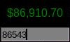

# tk-bitcoin.py
A real-time Bitcoin price monitor with sound alert.

This script fetches the latest Bitcoin price in USD from the Binance API and displays it in a minimalist GUI window using Tkinter. The window also includes an input field to set a custom alert price, which, when reached, triggers a sound alert.

## Screenshot

<p align="center">
  
</p>


## Requirements
- Python 3.x
- `tkinter` for the GUI (comes pre-installed with Python on most platforms)
- `pygame` for sound playback

### Install Dependencies
To install the necessary dependencies, run:
```bash
$ pip install pygame
```

## Usage

1. **Run the Script**: Execute `tk-bitcoin.py` from the terminal:
    ```bash
    $ ./tk-bitcoin.py
    ```
2. **Set an Alert Price**: Enter a Bitcoin price in the alert field. The current Bitcoin price is fetched every 5 seconds and displayed.
3. **Alert Trigger**: If the current Bitcoin price reaches or exceeds your alert price, a sound alert will be triggered.

### Controls
- **Set Alert Price**: Press **Enter** after typing a value in the alert field.
- **Close Window**: Press **Esc**.

## Configuration
- **API Source**: This script uses Binance's public API to retrieve the current Bitcoin price in USD.
- **Sound Alert File**: Make sure `correct-chime.mp3` is located in the same directory as the script for the sound alert feature to work.

## File Structure
```text
├── tk-bitcoin.py           # Main script file
└── correct-chime.mp3        # Sound file for the alert notification
```

## Notes
Ensure that your internet connection is active to retrieve the latest price. Adjust the alert value as desired. 

## Author
Fábio Berbert de Paula  
[GitHub Repository](https://github.com/fberbert/tk-bitcoin)
